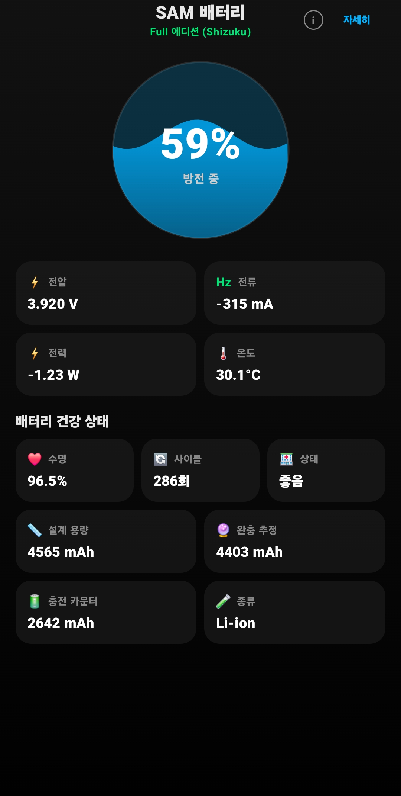
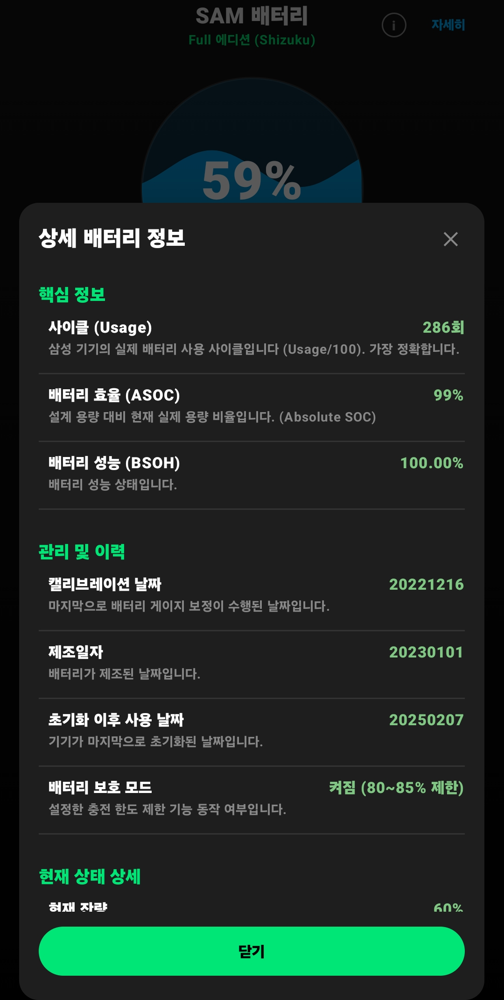

# SAM Battery (Samsung Analysis Monitor for Battery)

**SAM Battery**는 안드로이드 기기, 특히 삼성 갤럭시 디바이스의 배터리 상태를 심층적으로 분석하기 위한 전문가용 도구입니다. 사용자의 환경과 필요에 따라 **Non-Root** 버전과 **Full (Shizuku)** 버전을 선택하여 사용할 수 있습니다.

---

## 📸 스크린샷 (Screenshots)

<p align="center">
  
  
</p>

---

## ⚡ 에디션 비교 (Editions)

| 기능 / 특징 | 🟢 Non-Root Edition | 🔴 Full Edition (Shizuku) |
| :--- | :---: | :---: |
| **권한 요구** | 없음 (즉시 실행) | **Shizuku (ADB) 필수** |
| **사이클 (Cycle)** | API 조회 (보정값) | **시스템 로그 원본 (정밀)** |
| **수명 (SOH %)** | API 기반 추정치 (역산) | **시스템 기록값 (ASOC/BSOH)** |
| **제조일/캘리브레이션** | 접근 불가 | 📅 **확인 가능** |
| **과거 사용 이력** | 접근 불가 | 📜 **시간대별 로그 조회** |
| **충전 이벤트 로그** | 접근 불가 | 🔌 **연결/해제 이력 조회** |
| **실시간 정보** | 지원 (전압, 전류, 온도) | 지원 + **상세 데이터** |

---

## 📱 1. SAM Battery (Non-Root Edition)
**폴더명**: `SAM_Battery_NonRoot_new`

루팅이나 복잡한 설정 없이, **앱 설치 즉시** 사용할 수 있는 라이트 버전입니다. 안드로이드 표준 API를 최대한 활용하여 배터리 상태를 분석합니다.

### 🌟 주요 기능
*   **즉시 사용**: 별도 권한 설정 없이 설치하자마자 실행 가능.
*   **API 기반 모니터링**: 전압, 전류, 온도, 전력량을 실시간으로 표시.
*   **수명 추정 (Estimation)**: 현재 전하량과 잔량을 역산하여 설계 용량 대비 효율을 추정합니다.
*   **Wave UI**: 배터리 상태(충전/방전)에 따라 움직이는 미려한 인터페이스.

---

## 🚀 2. SAM Battery (Full Edition)
**폴더명**: `SAM_Battery_Full_new`

**Shizuku** 앱을 통해 시스템(`dumpsys battery`)에 접근하여, 제조사(Samsung) 서비스 센터 수준의 정밀한 로우 데이터를 열람할 수 있는 전문가 버전입니다.

### 🌟 주요 기능 (Non-Root 포함 + a)
*   **시스템 원본 데이터 판독**:
    *   **ASOC / BSOH**: 기기에 기록된 정확한 배터리 수명 %를 보여줍니다.
    *   **Real Cycle**: BMS가 기록한 정확한 충전 사이클 횟수를 읽어옵니다.
*   **상세 이력 조회 (Details Dialog)**:
    *   **수면/충전 패턴**: 기기가 학습한 충전 패턴 데이터를 확인.
    *   **전원 이벤트**: 충전 케이블 연결/해제 시각 기록 (Power Events).
    *   **캘리브레이션 정보**: `LLB CAL` (보정일), `LLB MAN` (제조일), `FirstUseDate` (최초 사용일).
*   **자동 새로고침**: Shizuku 권한 획득 시 즉시 데이터 갱신.
*   **Collapsible Logs**: 방대한 로그 데이터를 보기 쉽게 접고 펼칠 수 있는 UI.

---

## 📂 프로젝트 구조 (Directory Structure)

```
H:\github\android_battery_info\
├── SAM_Battery_Nonroot_new/  # [Light] 표준 API 기반 프로젝트
│   ├── app/src/main/java.../BatteryRepository.kt
│   └── ...
├── SAM_Battery_Full_new/     # [Pro] Shizuku 기반 프로젝트
│   ├── app/src/main/java.../ShizukuHelper.kt      # ADB 명령어 처리
│   ├── app/src/main/java.../MainActivity.kt       # 상세 로그 파싱 & UI
│   └── ...
└── Final_Release/            # [배포] 최신 APK 저장소
    ├── SAM_Battery_NonRoot_RELEASE.apk
    └── SAM_Battery_Full_RELEASE.apk
```

---

## 🛠 빌드 및 설치 (Build & Install)

### 공통 환경
*   **IDE**: Android Studio Ladybug / Koala
*   **Min SDK**: 26 (Android 8.0)
*   **Target SDK**: 35 (Android 15)

### 설치 방법
1.  **Non-Root**: `Final_Release` 폴더의 `SAM_Battery_NonRoot_RELEASE.apk` 설치 및 실행.
2.  **Full Edition**: 
    *   기기에 **[Shizuku](https://play.google.com/store/apps/details?id=moe.shizuku.privileged.api)** 앱 설치 및 활성화 (무선 디버깅 활용).
    *   `SAM_Battery_Full_RELEASE.apk` 설치.
    *   앱 실행 후 Shizuku 권한 허용.


